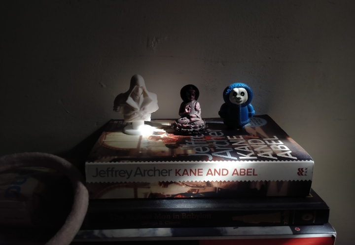
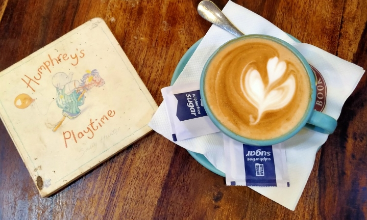

import Layout from '../components/layout.js';
export default ({children}) =>(
<Layout> {children}</Layout>
);

<h1 align='center'> 2022 Reading Recap </h1>

2022 was a year of diverse and exciting reading for me. I had the opportunity to dive into a wide range of genres, from science fiction to classic literature, and each book provided me with a unique and thrilling experience.

1. **Soonish** by Kelly and Zach Weinersmith. 
This book is a fascinating exploration of technology and the future, and it took me on a journey to discover the possibilities of what's to come. From space elevators to 3D printing, this book gave me an idea of what we can expect in the future. It was one of my most intresting read of 2022. This was also my longest book of 2022. 

2. **Introducing Heidegger** by Jeff Collins.
I delved into the world of philosophy with this book which provided me with an in-depth understanding of the life and work of Martin Heidegger. It was him who announced end of philosophy and was a vocal supporter of Nazism. He was of the opinion that when 'metaphysics is over; technology takes over'.

3. **Two Gentlemen of Verona and Comedy of Errors** by William Shakespeare.
These classic plays were a delight to read, filled with wit and humor that only Shakespeare can deliver. I was struck by the themes of friendship, love, and betrayal in "Two Gentlemen of Verona" and the comedic elements in "Comedy of Errors." Shakespeare's writing is timeless and it was a pleasure to revisit these works. Looking forward to reading more of his work in the future. His works are light-weight and made perfect travel companion.

4. **Humphry's Playtime** by Sally Hunter.
For a touch of childhood nostalgia, I read this charming and enjoyable children's book that reminded me of the joys of childhood. This was also my shortest book of 2022.

5. **Revenge** by King E Theodore.
For some heart-pumping action, I picked up this thrilling novel that disapointed me somewhat with the flow and the repetitive themes. Clearly Mr. King was alien to the subject he was writing about. 

6. **Fluid** by Ashish Jaiswal.
This book gave an insight into the science of fluid dynamics and its impact on our daily lives. The author's ability to make a complex subject accessible and engaging was impressive. This is a very random pick and I feel lucky to have stumbled across it. One of the only few self-help books I ever liked.

7. **The Great Gatsby** by F. Scott Fitzgerald.
This classic novel is a commentary on the excess and decadence of the Roaring Twenties. The characters were complex and the story was a powerful commentary on the human condition. I was particularly impressed by the way Fitzgerald portrayed the destructive nature of the American Dream.

8. **Animal Farm** by George Orwell
This political satire tells the story of a group of farm animals who overthrow their human farmer. The story is a powerful commentary on the nature of power and corruption. I was particularly struck by the way Orwell used the story of the animals to comment on the events of his time.

9. **Siddhartha** by Hermann Hesse.
For a spiritual journey, I read this novel that tells the story of a young man on a spiritual journey to find enlightenment. But Hermann Hesse did 0 homework when he decided to write this book. At all his flaws and instances of cultural appropriation, this could at best been an essay or a short story. 
What's more, even with desparate attempts, the book is painfully shallow and is not even about Buddhism or the founder of Buddhism- Siddhartha.

10. **Neurofitness** by Rahul Jindial.
This book delves into the science of how the brain functions and how we can optimize our brain's health and performance through various techniques and practices. No book got me as hooked as this one did. The author talks about sleep, drugs, food, plasticity, aging, creativity, learning, memory and what-not. Would definitely recommend.

11. **So long and thank you for the fish** by Douglas Adams
Funny as it is, I haven't read the prequels and directly jumped to this one. I bought this book as a souvenir and I never really planned on diving into the univrse of Douglas Adams but now I must say, I am hitched (XD). Would definitely love to read the prequels in the future.

In 2022, I had the pleasure of reading books from different genres, including science fiction, classic literature, philosophy, children's literature, thriller, non-fiction, and spiritual. It was an exciting year of reading and I can't wait to see what new books and genres I will discover in the future.

