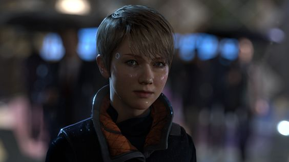
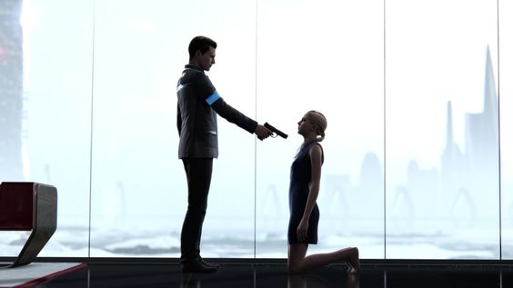

import Layout from '../components/layout.js';
export default ({children}) =>(
<Layout> {children}</Layout>
);

<h2 align="center"> Detroit: Become Human & the Inheritance of Humanity </h2>

<h3 align="center">Introduction</h3>
Detroit: Become Human is a 2018 thrd-person game, built around three "deviant"
androids, Kara, Markus & Conor, who are placed during the android revolt.

Detroit is a technologically sophisticated city in 2038. The most apparent
manifestation of life automation is the widespread usage of humanoid androids
exploited for vocations considered menial, repulsive, or dangerous: cleaners,
household staff, sexual escorts in nightclubs, builders, and others. They are
programmed to obey the **Three Laws of Robotics** (Asimov 1942; 1990)[[3]](https://en.wikipedia.org/wiki/Three_Laws_of_Robotics), which
assures their obedience and powerlessness to hurt their human owners. Those that
discover a method to "wake up" and transcend their programming are classified as
"deviants."

Human brutality and abuse imposed by humans are frequently the catalysts for their
awakening. The trigger for both Kara and Markus is an impending danger threatening
the person they care about, and therefore, curiously, the First Law itself serves as a
motive to breach it - they decide to harm one human in order to protect the other.
As the story develops, we witness that the androids do not seek to be acknowledged
as an autonomous group, but rather as human equals.

<h3 align="center">Can robots inherit the Earth?</h3>
In the future, we will need to modify our bodies and brains in order to live longer
and be more hyper - vigilant. To that purpose, we must first understand how
conventional Darwinian evolution landed us here. Eventually, we will be able to
effectively replace our brains via nanotechnology. Once we are free of the constraints
of biology, we will be able to decide on the various, hitherto unimagined potential
that 'life' has to offer. But this is already being done via different agency in the
game. We are going to further discuss the necessary aspects with referenece to the
critical context authored by **Marvin L. Minsky (Will Robots Inherit the Earth, 1994[[1]](https://web.media.mit.edu/~minsky/papers/sciam.inherit.html))**.

<h4>Health and Longevity</h4>

The genes of individuals who reproduce at a younger age are chosen by evolution.
Genes that extend lives beyond what parents require to care for their children are
not typically favoured by evolution. Androids, on the other hand, tend to be able to
accomplish this effortlessly since they can quickly replace their anatomical
components. Furthermore, their evolution (sentience) is prompted by a 'brain' function
to accomplish. <strong>They think and therefore they can</strong>. They and all the other 'obedient,
non-conscious' robots have one over on mankind in this basic need.

<h4>Biological Wearing-Out</h4>

As we understand more about our DNA, we expect to be able to fix, or at the very
least postpone, many of the disorders that still bother us in our later years. Even if
we discovered solutions for each individual ailment, we would
still have to deal with the broader
issue of "wearing out." Due to their
non-organic origins, the deviant
androids have already been weeded out
of this problem. As we saw in the
chapter **'Spare Parts,'** androids in any
state can be 'rejuvenated', given the
proper resources are available.

<h4>Limitations of Human Wisdom, Replacing the brain and Limits of Human Memory.</h4>

The brain, like all physical entities, must have definite learning boundaries. We don't
know what those constraints are; perhaps our brains can continue to learn for several
eons further. However, we will eventually need to enhance their capacity. We will
discover methods to replace every portion of the body and brain, repairing all of the
faults and imperfections that make our lives so brief.Needless to say, we'll be transforming ourselves into machines as a result. This is the
process that makes humans more like androids (perhaps pitching Detroit: Become
Android).

<h3 align="center">Conclusion</h3>

Will robots take over the world? Yes, because thinking otherwise deems to declare us
the end products of evolution which we for sure know is not true. And for reasons
we know that future is transhuman. Nonetheless, those will be our offspring. We
dedicate our thoughts to every species that have ever perished or prospered in the
conflict known as Evolution[[1]](https://web.media.mit.edu/~minsky/papers/sciam.inherit.html) . It is our obligation to guarantee that all of this hard
graft is not in vain.

Simply said, clever robots are the result of our minds, whereas human children are
the result of our DNA. They are our offspring because we created them.
Connor makes an active decision to turn deviant and therefore inherits rational
thinking. In an attempt to save her owner’s daughter and later by developing
maternal feelings for her, Kara inherits motherhood. Markus by standing up for his
likes, inherits pride and justice.\
And all three in their own unique way inherit humanity.

<h3>References</h3>
- [Will Robots Inherit the Earth~ Marvin L. Minsky](https://web.media.mit.edu/~minsky/papers/sciam.inherit.html)
- [Detroit: Become Human, 2018](https://store.steampowered.com/agecheck/app/1222140/)
- [Asimov's Laws of Robotics](https://en.wikipedia.org/wiki/Three_Laws_of_Robotics)

<h5><i>I wrote this article as part of my Science Fiction course in my sophomore year. We had to pick up an artifact and link it with a theory in class[1]. 500 word limit </i></h5>
