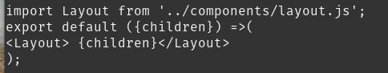
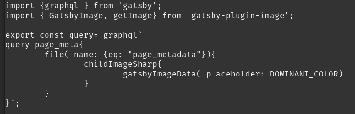
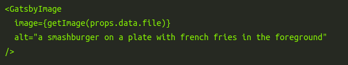

import Layout from '../components/layout.js';
export default ({children}) =>(
<Layout> {children}</Layout>
);

import {graphql } from 'gatsby';
import { GatsbyImage, getImage} from 'gatsby-plugin-image';

export const query= graphql`
query page_meta{
	file( name: {eq: "page_metadata"}){
		childImageSharp{
			gatsbyImageData( placeholder: DOMINANT_COLOR)
		}
	}	
}`;

# How to blog?

### Introduction
First of all, yes I get it. Seriously, a blog on how to blog? Well, its more for me than it is for you. 
Consider this like a README file of a github repo. Because this right here is not as straight forward as writing octaves in your text editor.
So where shall I begin. \
There are two ways to post content here
- a page written inside a custom React element
- a page rendered from MDX (like the one you are currently reading)\
Personally, I love the second because of the easy with which I can just push content out. 
Not to mention, the powerful formatting that comes with markdown, sparing me the headache to deal with HTML tags. And if at all needed, I can use HTML tags within MDX as well (sick).
### Why Gatsby
Incase it isn't know to you already, this site runs on Gatsby and is hosted on Netlify. But why Gatsby??
- Gatsby has unified data layer that enables me to easily combine data from different sources and render them alongside each other.
- Gatsby combines static-site generation, deferred static generation, and intelligent page rendering to selectively preload the content that matters.
- Gatsby is built on top of React, and combines cutting edge technologies like GraphQL, Webpack, and more to create an incredibly elegant experience. 

### Creating a post
For me, its as simple as doing
- naviagate to <i><strong>`cd src/posts && vim how-to-blog.mdx` </strong></i>

<GatsbyImage image={getImage(props.data.file)}
             alt="page metadata"
/>

- add page metadata

- rendering layout
- writing the content 
- Open terminal and run 
<i><strong>` git add how-to-blog.mdx && git commit -m 'how to blog added' && git push` </strong></i>  ,and we are done.
 
#### Rendering images
To render an image, I just need to have it stored in some subdirectory.
Next I need to import graphql, GatsbyImage & getImage.
- After that I just need to run a graphQL query like:\

... and fetch the image by

- alternatively, I can just do: <strong><i>  </i></strong> in my MDX file.

### Future Todos
1. Add footer & socials
2. Pretify
3. Add more blogs/READMEs
4. Have fun with writing :))

